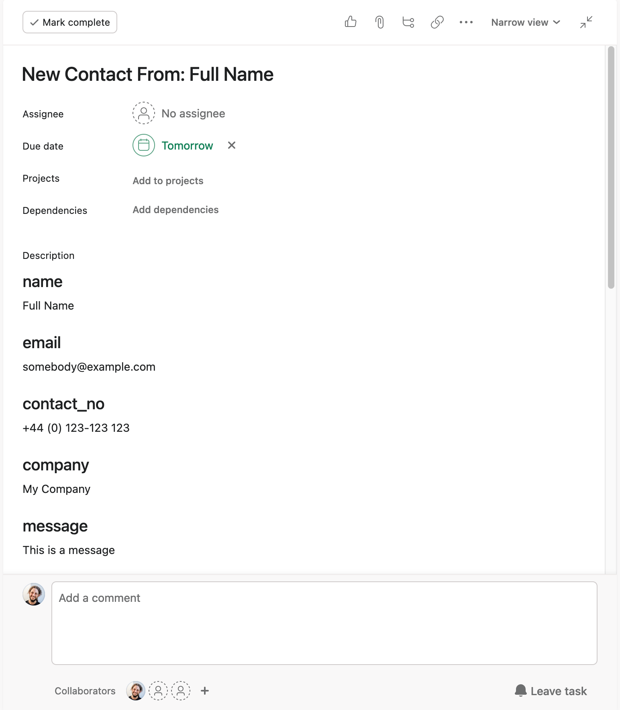

# Statamic Asana
<div style="text-align: center">
    
</div>

## Description

> Statamic Asana is a Statamic addon that captures form submissions and creates tasks in Asana based on them.



## Features

This addon is triggered when a Statamic form is submitted and creates a task in Asana containing all the relevant data.

## Quirks

The addon should work fine in Statamic 4, but you need Statamic 5 to run the tests. I didn't realise I would need to support 4 when I started it.

## How to Install

You can search for this addon in the `Tools > Addons` section of the Statamic control panel and click **install**, or run the following command from your project root:

``` bash
composer require steadfast-collective/statamic-asana
```

## How to Use

This addon is quite use-case specific at the moment and we will build it out as our needs evolve.

Setup the config in your .env and whenever a form is submitted, an Asana task will be created in the configured project with a title of "New Contact From {name}" where {name} is the value
of the name field.

In `config/statamic/statamic-asana.php` you can configure session keys to be included in the email - by default `landing_page_url` and `landing_page_referer` are included.

## Configuration

Add the following to your .env:

```
## Used by the statamic-asana package
STATAMIC_ASANA_PERSONAL_ACCESS_TOKEN= # Make this at https://app.asana.com/0/my-apps
STATAMIC_ASANA_WORKSPACE_ID="" # Get this from https://app.asana.com/api/1.0/workspaces?opt_pretty
STATAMIC_ASANA_PROJECT_GID= # Get this from https://app.asana.com/api/1.0/projects?opt_pretty
```

I presume there's a way to publish  `config/statamic/statamic-asana.php` to customise it but I haven't yet looked into that aspect of Statamic addons.

## Wishlist

The following are not currently supported, but would be nice to add:

 - Per-form configuration
 - Storing some details in Asana Custom Fields instead of all in the body
 - Assigning the task to someone
 - Configurable due date
 - Use form labels instead of indexes
 - Customisable title or view for the task description
 - Not requiring a 'name' field on the form
 - Including a form identifier if submitting to the API goes wrong
